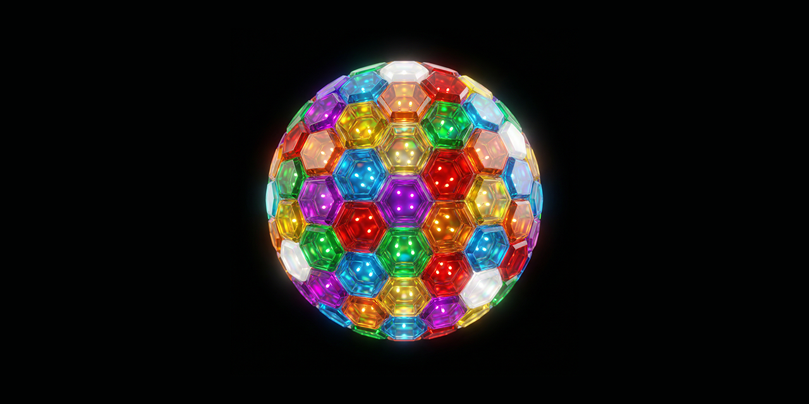

<p align="center">
  
</p>

> **[Omnidea](https://github.com/neonpixy/omnidea)** / **Library** · For AI-assisted development, see [CLAUDE.md](CLAUDE.md).

# Library


> **Public mirror.** Active development happens elsewhere.

Shared libraries for [Omnidea](https://github.com/neonpixy/omnidea). Five packages: a TypeScript SDK, a component library, a GPU glass renderer, a CRDT editor, and visual effects.

## Packages

| Package | Path | What It Is |
|---------|------|-----------|
| **@omnidea/net** | `sdk/` | TypeScript SDK — typed wrappers for Omninet pipeline operations. Auto-generated from Rust sources. |
| **@omnidea/ui** | `ui/` | Solid.js component library + UnoCSS theme. 54 components with neu and crystal modes. |
| **@omnidea/crystal** | `crystal/` | WebGPU glass effects — blur, refraction, SDF shapes, cursor-aware lighting. |
| **@omnidea/editor** | `editor/` | CRDT-backed editor — daemon owns SequenceRga, TypeScript owns the view. |
| **@omnidea/fx** | `fx/` | Visual effects — animated color, bevel, glow as Solid.js components. |

## Prerequisites

- **Node.js** 22+ and npm
- **Python 3** (for SDK code generation)
- Icons use [Remix Icon](https://remixicon.com/) (open source, no token needed)

## Quick Start

```bash
# Install all workspace dependencies
npm install

# Build all packages (sdk, crystal, ui — in correct order)
npm run build

# Or build individually
npm run build:sdk
npm run build:crystal
npm run build:ui
```

### Regenerate SDK from Omninet sources

The SDK types and operations are auto-generated from the Rust crate sources. After changes to Omninet:

```bash
npm run generate
```

This requires [Omninet](https://github.com/neonpixy/omninet) to be cloned at `../Omninet` (sibling directory). Override with `OMNINET_PATH` env var.

## Scripts

| Script | What It Does |
|--------|-------------|
| `npm run build` | Build sdk, crystal, and ui in dependency order |
| `npm run build:sdk` | Build @omnidea/net only |
| `npm run build:crystal` | Build @omnidea/crystal only |
| `npm run build:ui` | Build @omnidea/ui theme CSS only |
| `npm run generate` | Regenerate SDK from Omninet Rust sources |
| `npm run clean` | Remove all dist/ dirs and node_modules |

## Package Details

### @omnidea/net (SDK)

Auto-generated TypeScript types and pipeline operation wrappers. Two generated files:

- `src/generated/types.ts` — TypeScript interfaces from Rust structs/enums
- `src/generated/ops.ts` — Typed operation wrappers for all `divi_*` FFI functions

**Distribution:** `dist/` (compiled with `tsc`). Must be built before consumers can import.

### @omnidea/ui (Components)

54 Solid.js components with UnoCSS integration. Two visual modes: **neu** (flat surfaces) and **crystal** (WebGPU glass via Crystal).

**Distribution:** Source-distributed (`"main": "./src/lib/index.ts"`). No build step needed for consumers — import directly from source. The `npm run build` step only regenerates `theme.css` from design tokens.

### @omnidea/crystal (Glass)

GPU-accelerated glass effects using WebGPU. Blurred backdrops, SDF shapes, cursor-aware lighting.

**Distribution:** `dist/` (bundled with Vite). Must be built before consumers can import.

### @omnidea/editor (Editor)

CRDT-backed collaborative editor. Daemon owns the SequenceRga data structure, TypeScript owns the view layer. Solid.js component.

**Distribution:** Source-distributed. Import directly from source.

### @omnidea/fx (Effects)

Visual effects primitives — animated color, bevel, glow. Solid.js components for adding polish to UI surfaces.

**Distribution:** Source-distributed. Import directly from source.

## How It Relates to Other Repos

```
Omninet (protocol)    Library (shared libs)     Omny (browser)
  29 Rust crates   ->  @omnidea/net SDK   ->  Apps (programs)
  Regalia tokens   ->  @omnidea/ui theme  ->  visual design
                       @omnidea/crystal   ->  glass rendering
                       @omnidea/editor    ->  CRDT editing
```

All four repos are siblings inside an `Omnidea/` directory:

```
Omnidea/
  Covenant/   # the constitution
  Omninet/    # protocol
  Omny/       # browser
  Library/    # shared libraries (this repo)
```

## License

Licensed under the Omninet Covenant License.
